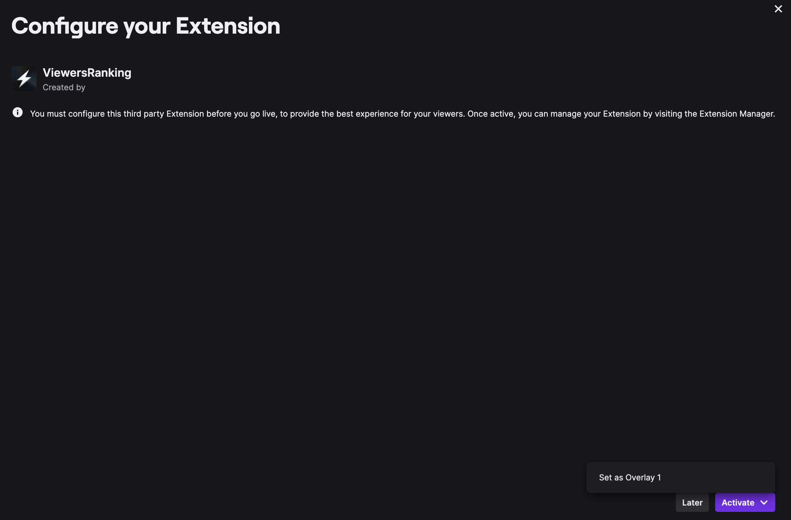

# How to run the application inside of Twitch

## Before all

Twitch doesn't allow urls without https to be used as webhook endpoints. So, its not possible to just use `http://localhost:800` to test the application. You can use any gateway of your preference to have a https url targeting your local machine. I'm used to work using [ngrok](https://ngrok.com/), but feel free to use any tool of your preference.

## Create a Twitch extension

- Log in to [Twitch developers portal](https://dev.twitch.tv/console) and click on **Extensions** on the left sidebar.


- On the [Extensions page](https://dev.twitch.tv/console/extensions), click on the **Create Extension** button on the right side. You'll be asked a name for you extension. Type the desired name and clock on **Continue**.


- You're going to be redirect to the **Create an Extension Version** page. Here you can configure the details of the this first version of the extension, like **Version number**, **Author**, **Summary**, etc. The most important thing in this page is the **Type of extension** field. For the **Viewers leaderboard** project, you need to select the **Video - Fullscreen** option. After selecting it, click on **Create Extension Version** at the bottom of the page.


- After that, your extension is created. Now, we just need to make some configuration to allow it to access the application running locally. On the presented page, click on the **Asset Hosting** tab. Here we can confire the url where the extension is accessible. By default, the frontend runs on port `5173`, but if you changed the default port, use it instead.

  - Change **Testing Base URI** to the base address of the application (http://localhost:5173 by default).
  - Change **Video - Fullscreen Viewer Path** to `/ranking` (This is the path where the **Ranking panel** is presented).
  - Change the **Config Path** to `/config`

After configuring the necessary options, click on **Save changes**.


- Now, we need to get the extension's **Client ID** and generate a **Client Secret**. Click on **Extension Settings** at the upper right corner. On the presented page, copy and store the **Client ID** and click on **Generate Secret** to create a secret, also copy and store this value.


- Also, on the same page, change the **OAuth Redirect URL** to the url of you app. Remember, this url need to be a https url. Just add the url, followed by the `/webhook_subscribe_callback` path.

  For example, if you got the url https://123url.com from ngrok. You should fill **https://123url.com/webhook_subscribe_callback** on the **OAuth Redirect URL**.


- With all the necessary data (Client ID and Secret), configure the correspondent on the `environment` section of the backend service on `docker-compose.yml` or you can fill the fields inside of `.env.backend`. If the file doesn't exist, you can copy the `.env.example` inside of `backend` repository to the root of this repository. Or just use the command `make setup-env`.

  ```
  #.env.backend

  twitch_signature_validation=true
  app_client_id="client_id"
  app_client_secret="cl13nt_s3cr3t"
  app_base_url="https://123url.com"
  ```

- Now, you can go back to **Extensions** on the left side panel, click on **Manage** on the right side of your extension name and click again on **Manage** on the right side of the current version of your extension.


- Then, you can go down the page and click on **View on Twitch and Install**.


- You'll be redirected to a page where you can install your extension to you channel. Just click the **+ Install** button, then **Active** and **Set as Overlay**.



- After installing the extension, you need to subscribe to the webhooks. You can do so going to your channel page, in the top right corner, click on your profile image and on **Creator Dashboard**. After that, click on **Extensions** on the sidebar and on **My Extensions**. Now, click on the gear icon closer to your extension, this will open the config page.

  The config page should present you with a link that you can access to authorize the webhook subscription using your Twitch account.


- Now, if you run the application and access your active livestream on your channel, you'll be able to see the extension icon on the left side of the player. Click on it and accept.


> [!IMPORTANT]
> Remember to remove the `VITE_FORCE_CHANNEL_ID` from `docker-compose.yml` and from `.env.frontend` if you running inside of Twitch. This will allow the application to fetch the ranking of your channel and not the one specified by the environment variable.

> [!IMPORTANT]
> Also, remember to use the same url as the `VITE_API_BASE_URL` environment variable for the frontend.

- Feel free to use the chat and check the score increasing on the ranking panel. For testing purposes, it's also adding score for the broadcaster itself (so you don't need to log into 2 accounts to test).